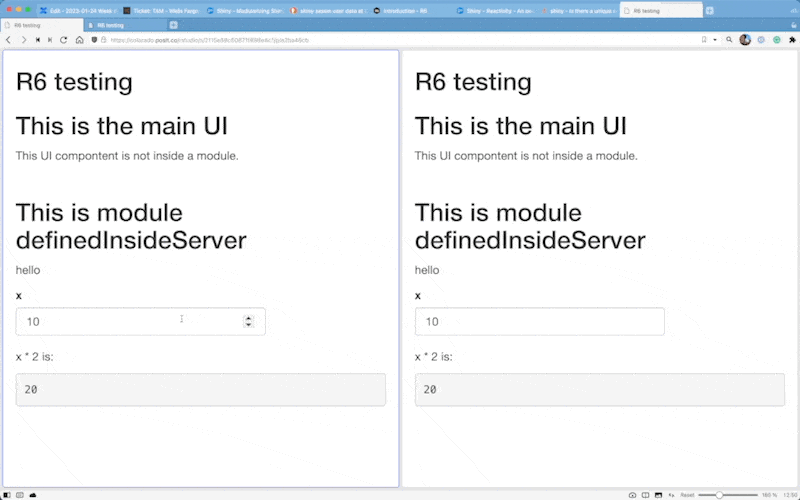
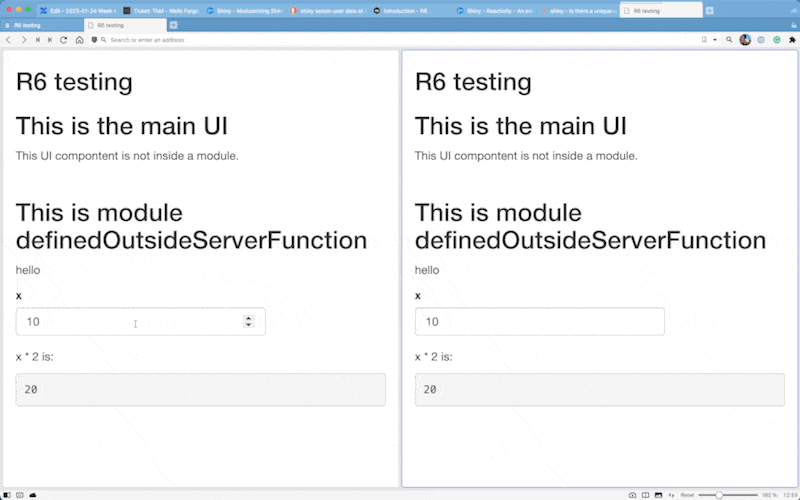

# r6-and-shiny

This repo demonstrates an approach to use R6Class shiny modules without sharing state.

## Example 1 - No shared state (the desired outcome)

The key to not share any state is to instantiate the module inside of the server function. See [app-shared-state.R](./app-shared-state.R).

```r
shiny::runApp('app-no-shared-state.R')
```

In the gif below two different sessions are running. Notice that the changes to the input box in one session have no effect on the other session.



## Example 2 - Shared state (the bad outcome)

In this example, the class is instantiated outside of the server function. See [app-shared-state.R](./app-shared-state.R).

```r
shiny::runApp('app-shared-state.R')
```

In the gif below two different sessions are running. Notice that the channges to the input box in one session have no effect on the other session.


